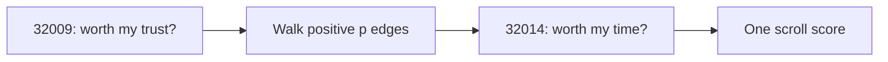

# Asking the right questions

AttentionX is a Web of Trust for **attention**. The protocol only works if
each kind answers one question. Mixing the questions produces likes that
pretend to be trust, or trust that pretends to score a post.

```text
32009  identity   →  Is this identity worth my trust?
32014  artifact   →  Is this artifact worth my time?
```

Answer **trust first**. Then consume ratings only from people who passed.
Without kind `32009`, a rating is a crowd score (platform likes, public
review sites). With it, the rating is **your network’s advice on
attention**.



Kind `32014` is specified in [NIP-32014.md](NIP-32014.md). Kind `32009` is
specified in [NIP-32009.md](NIP-32009.md). AttentionX does not yet
publish or ingest `32014`.

## Hard vs soft

| | Trust (`32009`) | Rating (`32014`) |
| --- | --- | --- |
| Question | Is this identity worth my trust? | Is this artifact worth my time? |
| Value | `v` = `1` / `0` / `-1` | `score` = `""` (cancel) or `0`–`100` |
| Graph | Positive `p` is a hop | **Never** a hop; never grants access |
| Feel | Hard, controllable | Soft, familiar (stars) |

`32009` can open a door (`c=security:access:…`) or expand whose judgments
you read. A four-star review must never do either. Publishing both on the
same subject is allowed; they mean different things.

## Agents vs artifacts

- **Trust UI** for people and issuers (`p`, X `user:id`). These can issue
  statements.
- **Rating UI** for dead things: posts, products, pages. They cannot issue
  trust.

A rating MAY target an npub or an X account as a **statement**. It still
does not expand the graph. For people, the default action remains Trust /
Distrust. Rating a person is a soft review, not “I will consume their
trust.”

## One scroll indicator

While scrolling, show **one** number: the average of active `32014`
scores from people you already trust.

- **High** → the network would invest time → read
- **Low** → spam, slop, noise → skip
- **None** → no signal yet → you decide

Who rated, which labels, and any comment belong behind a tap. The timeline
is not a review thread.

Product policy (not a protocol MUST): labels such as `spam` or `ai-slop`
MAY hide an item even when another trusted rater scored it high.

## Do not duplicate the host

Hosts already have social gestures. AttentionX adds the missing **score**.

| Surface | What to offer | Why |
| --- | --- | --- |
| X post (likes + replies exist) | Tags / stars that write `score`. No comment box. | Discussion is already there. X does not score the post. |
| Product / page with no review | Stars + optional comment + optional labels | The host has no review. You are the review. |

`content` stays optional on the wire. On a post, do not compose it.

A public Like is not a rating: it has no dislike, it is not filtered by
*your* web of trust, and it does not answer “worth my time.”

## Labels are shortcuts, not a second protocol

Optional `l` tags (`spam`, `ai-slop`, `genuine`, …) are the *why*. They
live on the same replaceable rating event. Clients MAY map them onto the
scale (spam / AI slop → `0`, genuine → `100`). One author, one subject,
one site, one purpose context: **one review**.
